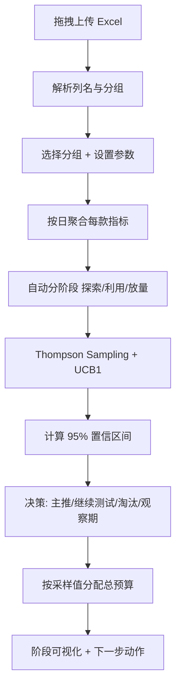

## 1. 产品概述
- 面向电商运营的多臂老虎机测款工具，用于全站推广/商品推广场景下，从分天数据表格中科学评估每个款的潜力、淘汰劣款、自动分配预算，节省推广成本。
- 目标用户：电商运营人员。核心价值：用顶会论文级算法（Thompson Sampling + UCB1）替代拍脑袋决策，给出置信度与明确下一步动作。

## 2. 核心功能

### 2.1 用户角色
| 角色 | 使用方式 | 核心权限 |
|------|----------|----------|
| 运营 | 浏览器打开 HTML，拖拽上传 Excel | 全部功能：分组切换、参数调整、查看决策、预算分配、阶段可视化 |

### 2.2 功能模块
1. **测款工作台（单页）**：拖拽上传 Excel → 自动识别分组 → 选分组 → 自动分阶段 → MAB 评估 → 决策与预算分配 → 阶段可视化

### 2.3 页面详情
| 页面名称 | 模块名称 | 功能描述 |
|----------|----------|----------|
| 测款工作台 | 上传区 | 拖拽/点击上传 xlsx，自动解析列名与分组 |
| 测款工作台 | 控制面板 | 分组下拉切换、目标投产比/CTR/CVR/展现量门槛/样本量阈值可调、总预算输入 |
| 测款工作台 | 阶段标签 | 自动分阶段（探索期/利用期/放量期），点击切换各阶段视图 |
| 测款工作台 | 款级决策表 | 每款：ROI/CTR/CVR、达标率、95%置信区间、Thompson采样值、决策(主推/继续测试/淘汰/观察期)、置信度、建议动作 |
| 测款工作台 | 预算分配 | 按Thompson采样值自动分配总预算到各款，显示金额与百分比，标注"下一步动作"（加预算/暂停/维持） |
| 测款工作台 | 阶段可视化 | 各阶段款数分布、置信区间对比图、预算分配条形图 |
| 测款工作台 | 链接下钻 | 点击某款展开其下各链接(商品ID)的花费/ROI/CVR对比 |

## 3. 核心流程
运营拖拽上传表格 → 系统解析列与分组 → 运营选分组并设参数 → 系统按日聚合每个款的指标 → 自动判定阶段（按累计花费/样本量）→ 对每款跑 Thompson Sampling(Beta后验)+UCB1 → 计算95%置信区间 → 按置信区间不重叠判定主推/淘汰 → 按Thompson采样值分配总预算 → 输出决策表+可视化+下一步动作。

## 4. 用户界面设计

### 4.1 设计风格
- 主题：深色专业数据工作台（运营长时间盯盘，深色护眼）
- 主色：墨黑底 #0B0F14 + 数据青 #22D3EE 强调 + 涨绿 #34D399 / 跌红 #F87171
- 字体：标题用 "Space Grotesk" 风格的几何无衬线（实际用系统可用的 distinctive 字体），正文用等宽 "JetBrains Mono" 数据列、中文用 "Noto Sans SC"
- 布局：顶部控制栏 + 左侧阶段标签 + 主区决策表 + 右侧预算分配面板
- 卡片式模块，圆角 12px，细微辉光边框

### 4.2 页面设计概览
| 页面名称 | 模块名称 | UI 元素 |
|----------|----------|----------|
| 测款工作台 | 上传区 | 虚线拖拽框，悬停高亮，拖入后显示文件名与解析进度 |
| 测款工作台 | 控制面板 | 分组下拉、数值输入框、滑块、总预算输入 |
| 测款工作台 | 阶段标签 | 三个胶囊按钮，当前阶段高亮带辉光 |
| 测款工作台 | 决策表 | 表格行按决策着色，置信区间用横向误差条渲染 |
| 测款工作台 | 预算分配 | 横向条形图 + 金额标签 + 动作徽章 |

### 4.3 响应式
- 桌面优先（运营在 PC 使用），最小宽度 1280px，表格横向滚动兼容窄屏

## 5. 算法与论文依据
- **Thompson Sampling (Beta-Bernoulli 共轭后验)**：Chapelle & Li (2011), NeurIPS 24 — 顶会
- **UCB1 置信上界**：Auer, Cesa-Bianchi & Fischer (2002), Machine Learning — 经典顶刊
- **达标判定多指标组合**：ROI(核心经济) + CTR(吸引力) + CVR(承接力) + 展现量门槛(样本有效性)，参考 KDD/WWW 广告 bandit 系列论文的行业标准做法
- **淘汰规则**：95% 置信区间不重叠 —— 某款 CI 上界 ≤ 最优款 CI 下界 → 直接淘汰
- **预算分配**：按 Thompson 采样值归一化分配总预算

## 6. 阶段定义（自动分阶段）
- **探索期**：累计花费 < 30元 或 有花费天数 < 2 —— 样本不足，均匀给量探索
- **利用期**：样本达标但置信区间跨越阈值 —— 维持测试，积累数据
- **放量期**：置信度高（CI 下界≥0.5）—— 集中预算主推
