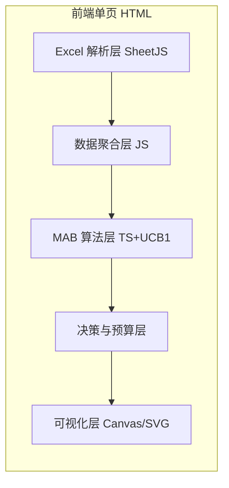

## 1. 架构设计
纯前端单页应用，无后端。所有 Excel 解析、MAB 算法、可视化均在浏览器本地完成，数据不出本机。

## 2. 技术选型
- 前端：纯原生 HTML + CSS + JS（单文件，零构建，运营双击即用）
- Excel 解析：SheetJS (xlsx.full.min.js) CDN
- 图表：自绘 SVG（置信区间误差条、预算条形图、阶段分布），无重型图表库依赖
- 算法：JS 实现 Thompson Sampling(Beta后验蒙特卡洛) + UCB1 + 置信区间不重叠判定
- 部署：本地 HTML 文件，可选放任意静态服务器

## 3. 路由定义
单页无路由，仅一个工作台视图，通过阶段标签切换内部视图状态。

## 4. 数据模型（前端内存结构）
- rawRows：原始表格行（来自 SheetJS）
- aggregated：按商品名称(款)聚合后的款数组，每款含 {name, links[], days, paidDays, targetRoi, spend, gmv, deals, clicks, impressions, ctr, cvr, roi, hitDays, missDays, alpha, beta, pMean, pLo, pHi, ucb, ts, decision, confidence, stage, budgetShare, nextAction}
- params：{group, targetRoi, ctrThr, cvrThr, impThr, minDeals, minSpend, minDays, totalBudget}
- stages：{explore:[], exploit:[], scale:[]}

## 5. 算法实现要点
- Beta 后验：alpha=hitDays+1, beta=missDays+1，蒙特卡洛 20000 次采样取均值与 2.5/97.5 分位
- UCB1：mean + sqrt(2*ln(N_total)/n_i)
- 达标判定：每日 ROI≥目标投产比 且 CTR≥ctrThr 且 CVR≥cvrThr 且 展现量≥impThr → 记一日达标
- 淘汰：某款 pHi ≤ 最优款 pLo → 淘汰
- 预算分配：softmax(Thompson采样值) × 总预算，淘汰款分配 0

## 6. 阶段自动划分
- 探索期：spend<minSpend 或 paidDays<minDays
- 利用期：样本达标但 pLo<0.5（CI 跨越阈值）
- 放量期：pLo≥0.5 且 pMean≥0.6
- 淘汰：pHi≤最优款pLo
